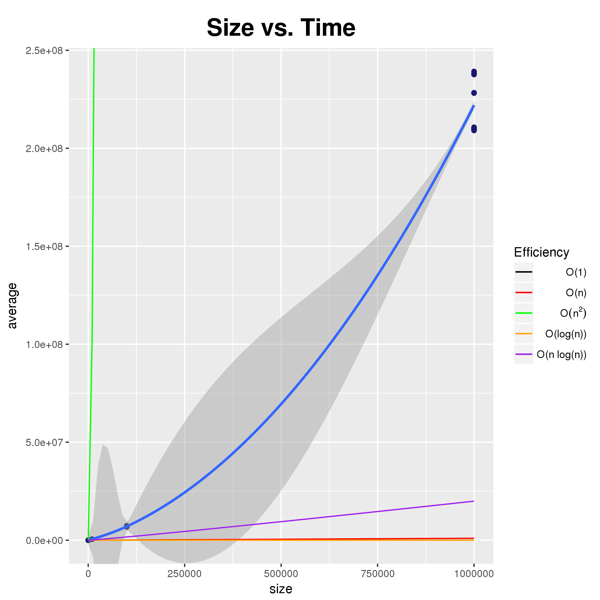

# TimeKeepers

## Runtime classification of QuickSort

The best case scenario for QuickSort is if the "pivot" point chosen every time
is the median. Each recursive call will process half of the list, so only log(n)
calls will need to be made to process the entire list. In addition to that,
since the underlying partition() method runs on each element roughly once, the
total runtime becomes **`O(n * log(n))`**.

The worst case occurs when the list is divided with the pivot point being either
the smallest or largest number in the dataset. This results in each recursive
call processing a list only one item smaller than the previous list. This
results in qsort() going through the whole list once and partition() going
through the whole list once for every call from qsort(), resulting in a **`O(n
^ 2)`** runtime.

On average, we would expect the function to perform between `n * log(n)` time
and `n ^ 2` time. However, the slope of `n ^ 2` is so large that when scaling up
to large datasets, the time would be much closer to `n * log(n)` than it would
be to `n ^ 2`. Therefore, the average runtime is roughly **`O(n * log(n))`**.

## Measurements

Our team initialized a start variable with the current time, ran qsort() on an
array of a fixed size with randomized values many times, then took the average
to get a rough runtime estimate. Output was collected and put into
[results.csv](./results.csv). The data was then graphed using
[`analyze.R`](https://github.com/gnewman00/MadSmarts/blob/parallel/analyze.R)
from a different runtime test. The data from the included
[results.csv](./results.csv) looks like this when graphed:

Note how the line of best-fit is closer to the `O(n * log(n))` line than it is
to the `O(n ^ 2)` line.

